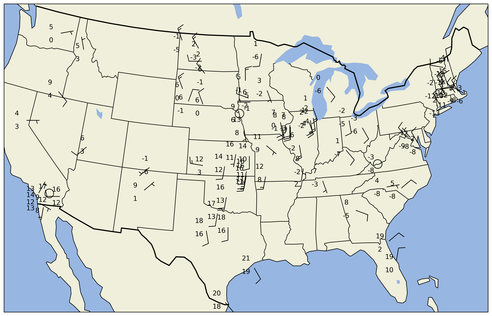

===========================
Surface Obs Plot with MetPy
===========================
`Notebook <http://nbviewer.ipython.org/github/Unidata/python-awips/blob/master/examples/notebooks/Surface_Obs_Plot_with_MetPy.ipynb>`_

Based on the MetPy example `"Station Plot with
Layout" <http://metpy.readthedocs.org/en/latest/examples/generated/Station_Plot_with_Layout.html>`_

.. code:: python

    %matplotlib inline
    import matplotlib.pyplot as plt
    import numpy as np
    from awips.dataaccess import DataAccessLayer
    
    from metpy.calc import get_wind_components
    from metpy.cbook import get_test_data
    from metpy.plots import StationPlot, StationPlotLayout, simple_layout
    from metpy.units import units
    
    # Initialize
    DataAccessLayer.changeEDEXHost("edex.unidata.ucar.edu")
    
    data,latitude,longitude,stationName,temperature,dewpoint,seaLevelPress,windDir,windSpeed = [],[],[],[],[],[],[],[],[]
    request = DataAccessLayer.newDataRequest()
    request.setDatatype("obs")
    
    
    #
    # we need to set one station to query latest time.  this is hack-y and should be fixed
    # because when you DON'T set a location name, you tend to get a single observation
    # that came in a second ago, so your "latest data for the last time for all stations"
    # data array consists of one village in Peru and time-matching is suspect right now.
    #
    # So here take a known US station (OKC) and hope/assume that a lot of other stations 
    # are also reporting (and that this is a 00/20/40 ob). 
    #
    request.setLocationNames("KOKC")
    datatimes = DataAccessLayer.getAvailableTimes(request)
    
    # Get most recent time for location
    time = datatimes[0].validPeriod
    
    # "presWeather","skyCover","skyLayerBase"
    # are multi-dimensional(??) and returned seperately (not sure why yet)... deal with those later
    request.setParameters("presWeather","skyCover", "skyLayerBase","stationName","temperature","dewpoint","windDir","windSpeed",
                          "seaLevelPress","longitude","latitude")
    request.setLocationNames()
    response = DataAccessLayer.getGeometryData(request,times=time)
    print time
    PRES_PARAMS = set(["presWeather"])
    SKY_PARAMS = set(["skyCover", "skyLayerBase"])
    # Build ordered arrays
    wx,cvr,bas=[],[],[]
    for ob in response:
        #print ob.getParameters()
        if set(ob.getParameters()) & PRES_PARAMS :
            wx.append(ob.getString("presWeather"))
            continue
        if set(ob.getParameters()) & SKY_PARAMS :
            cvr.append(ob.getString("skyCover"))
            bas.append(ob.getNumber("skyLayerBase"))
            continue
        latitude.append(float(ob.getString("latitude")))
        longitude.append(float(ob.getString("longitude")))
        #stationName.append(ob.getString("stationName"))
        temperature.append(float(ob.getString("temperature")))
        dewpoint.append(float(ob.getString("dewpoint")))
        seaLevelPress.append(float(ob.getString("seaLevelPress")))
        windDir.append(float(ob.getString("windDir")))
        windSpeed.append(float(ob.getString("windSpeed")))
        
        
    print len(wx)
    print len(temperature)
    
    
    # Convert
    data = dict()
    data['latitude']  = np.array(latitude)
    data['longitude'] = np.array(longitude)
    data['air_temperature'] = np.array(temperature)* units.degC
    data['dew_point_temperature'] = np.array(dewpoint)* units.degC
    #data['air_pressure_at_sea_level'] = np.array(seaLevelPress)* units('mbar')
    u, v = get_wind_components(np.array(windSpeed) * units('knots'),
                               np.array(windDir) * units.degree)
    data['eastward_wind'], data['northward_wind'] = u, v
    
    # Convert the fraction value into a code of 0-8, which can be used to pull out
    # the appropriate symbol
    #data['cloud_coverage'] = (8 * data_arr['cloud_fraction']).astype(int)
    
    # Map weather strings to WMO codes, which we can use to convert to symbols
    # Only use the first symbol if there are multiple
    #wx_text = make_string_list(data_arr['weather'])
    #wx_codes = {'':0, 'HZ':5, 'BR':10, '-DZ':51, 'DZ':53, '+DZ':55,
    #            '-RA':61, 'RA':63, '+RA':65, '-SN':71, 'SN':73, '+SN':75}
    #data['present_weather'] = [wx_codes[s.split()[0] if ' ' in s else s] for s in wx]
    
    # Set up the map projection
    import cartopy.crs as ccrs
    import cartopy.feature as feat
    from matplotlib import rcParams
    rcParams['savefig.dpi'] = 255
    proj = ccrs.LambertConformal(central_longitude=-95, central_latitude=35,
                                 standard_parallels=[35])
    state_boundaries = feat.NaturalEarthFeature(category='cultural',
                                                name='admin_1_states_provinces_lines',
                                                scale='110m', facecolor='none')
    # Create the figure
    fig = plt.figure(figsize=(20, 10))
    ax = fig.add_subplot(1, 1, 1, projection=proj)
    
    # Add map elements 
    ax.add_feature(feat.LAND, zorder=-1)
    ax.add_feature(feat.OCEAN, zorder=-1)
    ax.add_feature(feat.LAKES, zorder=-1)
    ax.coastlines(resolution='110m', zorder=2, color='black')
    ax.add_feature(state_boundaries)
    ax.add_feature(feat.BORDERS, linewidth='2', edgecolor='black')
    ax.set_extent((-118, -73, 23, 50))
    
    # Start the station plot by specifying the axes to draw on, as well as the
    # lon/lat of the stations (with transform). We also the fontsize to 12 pt.
    stationplot = StationPlot(ax, data['longitude'], data['latitude'],
                              transform=ccrs.PlateCarree(), fontsize=12)
    
    # The layout knows where everything should go, and things are standardized using
    # the names of variables. So the layout pulls arrays out of `data` and plots them
    # using `stationplot`.
    simple_layout.plot(stationplot, data)

.. parsed-literal::

    (Apr 10 16 12:52:00 , Apr 10 16 12:52:00 )
    425
    85

