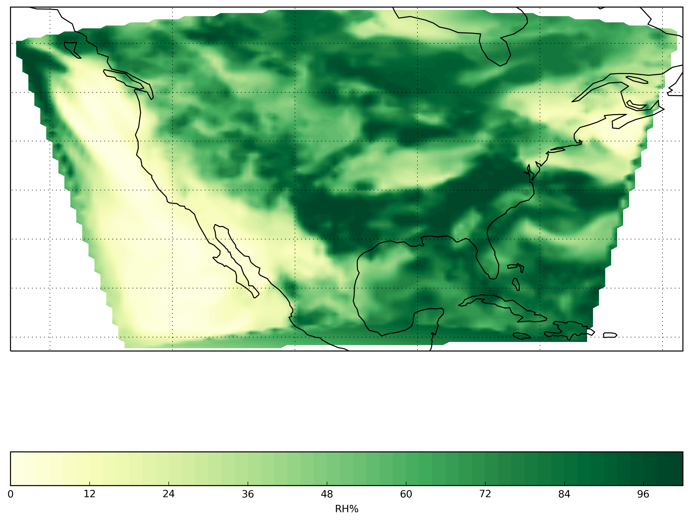

============
Gridded Data
============
`Notebook <http://nbviewer.ipython.org/github/Unidata/python-awips/blob/master/examples/notebooks/Gridded_Data.ipynb>`_

EDEX Grid Inventory
-------------------

.. code:: python

    from awips.dataaccess import DataAccessLayer
    
    # Set host
    DataAccessLayer.changeEDEXHost("edex-cloud.unidata.ucar.edu")
    
    # Init data request
    request = DataAccessLayer.newDataRequest()
    
    # Set datatype
    request.setDatatype("grid")
    
    # Get a list of all available models
    available_grids = DataAccessLayer.getAvailableLocationNames(request)
    
    # Sort
    available_grids.sort()
    
    for grid in available_grids:
        print grid

.. parsed-literal::

    AVN211
    AVN225
    DGEX
    ECMF-Global
    ECMF1
    ECMF10
    ECMF11
    ECMF12
    ECMF2
    ECMF3
    ECMF4
    ECMF5
    ECMF6
    ECMF7
    ECMF8
    ECMF9
    ETA
    GFS
    GFS40
    GFSGuide
    GFSLAMP5
    HPCGuide
    HPCqpfNDFD
    HRRR
    LAMP2p5
    MRMS_1000
    NAM12
    NAM40
    NCWF
    NOHRSC-SNOW
    NamDNG
    NamDNG5
    QPE-MSR
    RAP13
    RAP40
    RTMA
    RTMA5
    URMA25
    estofsPR
    estofsUS

**LocationNames** is different for different plugins - radar is icao -
satellite is sector

Requesting a Grid
-----------------

.. code:: python

    # Grid request
    request.setLocationNames('RAP40')
    request.setParameters("RH")
    request.setLevels("850MB")
    
    # Get available times
    t = DataAccessLayer.getAvailableTimes(request)
    
    # Select last available time [-1]
    response = DataAccessLayer.getGridData(request, [t[0]])
    data = response[0]
    lon,lat = data.getLatLonCoords()
    
    # Print info
    print 'Time :', t[-1]
    print 'Model:', data.getLocationName()
    print 'Unit :', data.getUnit()
    print 'Parm :', data.getParameter()
    
    # Print data array
    print data.getRawData().shape
    print data.getRawData()
    print "lat array =", lat
    print "lon array =", lon

.. parsed-literal::

    Time : 2016-02-23 15:00:00 (12)
    Model: RAP40
    Unit : %
    Parm : RH
    (151, 113)
    [[ 93.05456543  93.05456543  87.05456543 ...,  73.05456543  72.05456543
       71.05456543]
     [ 70.05456543  70.05456543  67.05456543 ...,  69.05456543  46.05456924
       37.05456924]
     [ 40.05456924  56.05456924  68.05456543 ...,  51.05456924  73.05456543
       74.05456543]
     ..., 
     [ 65.05456543  62.05456924  63.05456924 ...,  67.05456543  65.05456543
       46.05456924]
     [ 48.05456924  59.05456924  62.05456924 ...,   4.05456877   5.05456877
        5.05456877]
     [  7.05456877   8.05456829  10.05456829 ...,  91.05456543  95.05456543
       95.05456543]]
    lat array = [[ 54.24940109  54.35071945  54.45080566 ...,  57.9545517   57.91926193
       57.88272858]
     [ 57.84495163  57.80593109  57.76566696 ...,  58.07667542  58.08861542
       58.09931183]
     [ 58.10876846  58.11697769  58.12394714 ...,  56.40270996  56.46187973
       56.51980972]
     ..., 
     [ 19.93209648  19.89832115  19.86351395 ...,  20.054636    20.06362152
       20.07156372]
     [ 20.0784626   20.08431816  20.08912849 ...,  18.58354759  18.63155174
       18.67854691]
     [ 18.72453308  18.76950836  18.81346893 ...,  17.49624634  17.42861557
       17.36001205]]
    lon array = [[-139.83120728 -139.32348633 -138.81448364 ...,  -79.26060486
       -78.70166016  -78.14326477]
     [ -77.58544922  -77.02822876  -76.47161865 ..., -100.70157623
      -100.13801575  -99.57427216]
     [ -99.01037598  -98.44634247  -97.88218689 ..., -121.69165039
      -121.15060425 -120.60871887]
     ..., 
     [ -82.65139008  -82.26644897  -81.88170624 ...,  -98.52494049
       -98.13802338  -97.75105286]
     [ -97.36403656  -96.97698212  -96.58989716 ..., -113.07767487
      -112.69831085 -112.31866455]
     [-111.93874359 -111.5585556  -111.17810822 ...,  -69.85433197
       -69.48160553  -69.10926819]]

Plotting a Grid with Basemap
----------------------------

Using **matplotlib**, **numpy**, and **basemap**:

.. code:: python

    import matplotlib.tri as mtri
    import matplotlib.pyplot as plt
    from matplotlib.transforms import offset_copy
    from mpl_toolkits.basemap import Basemap, cm
    import numpy as np
    from numpy import linspace, transpose
    from numpy import meshgrid
    
    
    plt.figure(figsize=(12, 12), dpi=100)
    lons,lats = data.getLatLonCoords()
    
    map = Basemap(projection='cyl',
          resolution = 'c',
          llcrnrlon = lons.min(), llcrnrlat = lats.min(),
          urcrnrlon =lons.max(), urcrnrlat = lats.max()
    )
    map.drawcoastlines()
    map.drawstates()
    map.drawcountries()
    
    # 
    # We have to reproject our grid, see https://stackoverflow.com/questions/31822553/m
    #
    x = linspace(0, map.urcrnrx, data.getRawData().shape[1])
    y = linspace(0, map.urcrnry, data.getRawData().shape[0])
    xx, yy = meshgrid(x, y)
    ngrid = len(x)
    rlons = np.repeat(np.linspace(np.min(lons), np.max(lons), ngrid),
              ngrid).reshape(ngrid, ngrid)
    rlats = np.repeat(np.linspace(np.min(lats), np.max(lats), ngrid),
              ngrid).reshape(ngrid, ngrid).T
    tli = mtri.LinearTriInterpolator(mtri.Triangulation(lons.flatten(),
              lats.flatten()), data.getRawData().flatten())
    rdata = tli(rlons, rlats)
    cs = map.contourf(rlons, rlats, rdata, latlon=True, vmin=0, vmax=100, cmap='YlGn')
    
    # add colorbar.
    cbar = map.colorbar(cs,location='bottom',pad="5%")
    cbar.set_label(data.getParameter() + data.getUnit() )
    
    # Show plot
    plt.show()

.. image:: Gridded_Data_files/Gridded_Data_5_0.png

or use **pcolormesh** rather than **contourf**

.. code:: python

    plt.figure(figsize=(12, 12), dpi=100)
    map = Basemap(projection='cyl',
          resolution = 'c',
          llcrnrlon = lons.min(), llcrnrlat = lats.min(),
          urcrnrlon =lons.max(), urcrnrlat = lats.max()
    )
    map.drawcoastlines()
    map.drawstates()
    map.drawcountries()
    cs = map.pcolormesh(rlons, rlats, rdata, latlon=True, vmin=0, vmax=100, cmap='YlGn')

.. image:: Gridded_Data_files/Gridded_Data_7_0.png

Plotting a Grid with Cartopy
----------------------------

.. code:: python

    import os
    import matplotlib.pyplot as plt
    import numpy as np
    import iris
    import cartopy.crs as ccrs
    from cartopy import config
    
    lon,lat = data.getLatLonCoords()
    plt.figure(figsize=(12, 12), dpi=100)
    ax = plt.axes(projection=ccrs.PlateCarree())
    cs = plt.contourf(rlons, rlats, rdata, 60, transform=ccrs.PlateCarree(), vmin=0, vmax=100, cmap='YlGn')
    ax.coastlines()
    ax.gridlines()
    
    # add colorbar
    cbar = plt.colorbar(orientation='horizontal')
    cbar.set_label(data.getParameter() + data.getUnit() )
    plt.show()

.. code:: python

    import matplotlib.pyplot as plt
    import numpy as np
    
    from metpy.calc import get_wind_components
    from metpy.cbook import get_test_data
    from metpy.plots import StationPlot, StationPlotLayout, simple_layout
    from metpy.units import units
    
    # Initialize
    data,latitude,longitude,stationName,temperature,dewpoint,seaLevelPress,windDir,windSpeed = [],[],[],[],[],[],[],[],[]
    request = DataAccessLayer.newDataRequest()
    request.setDatatype("obs")
    
    #
    # we need to set one station to query latest time.  this is hack-y and should be fixed
    # because when you DON'T set a location name, you tend to get a single observation
    # that came in a second ago, so your "latest data for the last time for all stations"
    # data array consists of one village in Peru and time-matching is suspect right now.
    #
    # So here take a known US station (OKC) and hope/assume that a lot of other stations 
    # are also reporting (and that this is a 00/20/40 ob). 
    #
    request.setLocationNames("KOKC")
    datatimes = DataAccessLayer.getAvailableTimes(request)
    
    # Get most recent time for location
    time = datatimes[-1].validPeriod
    
    # "presWeather","skyCover","skyLayerBase"
    # are multi-dimensional(??) and returned seperately (not sure why yet)... deal with those later
    request.setParameters("presWeather","skyCover", "skyLayerBase","stationName","temperature","dewpoint","windDir","windSpeed",
                          "seaLevelPress","longitude","latitude")
    request.setLocationNames()
    response = DataAccessLayer.getGeometryData(request,times=time)
    print time
    PRES_PARAMS = set(["presWeather"])
    SKY_PARAMS = set(["skyCover", "skyLayerBase"])
    # Build ordered arrays
    wx,cvr,bas=[],[],[]
    for ob in response:
        #print ob.getParameters()
        if set(ob.getParameters()) & PRES_PARAMS :
            wx.append(ob.getString("presWeather"))
            continue
        if set(ob.getParameters()) & SKY_PARAMS :
            cvr.append(ob.getString("skyCover"))
            bas.append(ob.getNumber("skyLayerBase"))
            continue
        latitude.append(float(ob.getString("latitude")))
        longitude.append(float(ob.getString("longitude")))
        #stationName.append(ob.getString("stationName"))
        temperature.append(float(ob.getString("temperature")))
        dewpoint.append(float(ob.getString("dewpoint")))
        seaLevelPress.append(float(ob.getString("seaLevelPress")))
        windDir.append(float(ob.getString("windDir")))
        windSpeed.append(float(ob.getString("windSpeed")))
        
        
    print len(wx)
    print len(temperature)
    
    
    # Convert
    data = dict()
    data['latitude']  = np.array(latitude)
    data['longitude'] = np.array(longitude)
    data['air_temperature'] = np.array(temperature)* units.degC
    data['dew_point_temperature'] = np.array(dewpoint)* units.degC
    #data['air_pressure_at_sea_level'] = np.array(seaLevelPress)* units('mbar')
    u, v = get_wind_components(np.array(windSpeed) * units('knots'),
                               np.array(windDir) * units.degree)
    data['eastward_wind'], data['northward_wind'] = u, v
    
    # Convert the fraction value into a code of 0-8, which can be used to pull out
    # the appropriate symbol
    #data['cloud_coverage'] = (8 * data_arr['cloud_fraction']).astype(int)
    
    # Map weather strings to WMO codes, which we can use to convert to symbols
    # Only use the first symbol if there are multiple
    #wx_text = make_string_list(data_arr['weather'])
    #wx_codes = {'':0, 'HZ':5, 'BR':10, '-DZ':51, 'DZ':53, '+DZ':55,
    #            '-RA':61, 'RA':63, '+RA':65, '-SN':71, 'SN':73, '+SN':75}
    #data['present_weather'] = [wx_codes[s.split()[0] if ' ' in s else s] for s in wx]
    
    # Set up the map projection
    import cartopy.crs as ccrs
    import cartopy.feature as feat
    from matplotlib import rcParams
    rcParams['savefig.dpi'] = 255
    proj = ccrs.LambertConformal(central_longitude=-95, central_latitude=35,
                                 standard_parallels=[35])
    state_boundaries = feat.NaturalEarthFeature(category='cultural',
                                                name='admin_1_states_provinces_lines',
                                                scale='110m', facecolor='none')
    # Create the figure
    fig = plt.figure(figsize=(20, 10))
    ax = fig.add_subplot(1, 1, 1, projection=proj)
    
    # Add map elements 
    ax.add_feature(feat.LAND, zorder=-1)
    ax.add_feature(feat.OCEAN, zorder=-1)
    ax.add_feature(feat.LAKES, zorder=-1)
    ax.coastlines(resolution='110m', zorder=2, color='black')
    ax.add_feature(state_boundaries)
    ax.add_feature(feat.BORDERS, linewidth='2', edgecolor='black')
    ax.set_extent((-118, -73, 23, 50))
    
    # Start the station plot by specifying the axes to draw on, as well as the
    # lon/lat of the stations (with transform). We also the fontsize to 12 pt.
    stationplot = StationPlot(ax, data['longitude'], data['latitude'],
                              transform=ccrs.PlateCarree(), fontsize=12)
    
    # The layout knows where everything should go, and things are standardized using
    # the names of variables. So the layout pulls arrays out of `data` and plots them
    # using `stationplot`.
    simple_layout.plot(stationplot, data)

.. parsed-literal::

    (Mar 15 16 22:52:00 , Mar 15 16 22:52:00 )
    430
    86

.. image:: Gridded_Data_files/Gridded_Data_10_1.png

